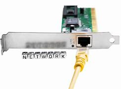
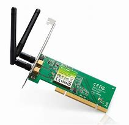
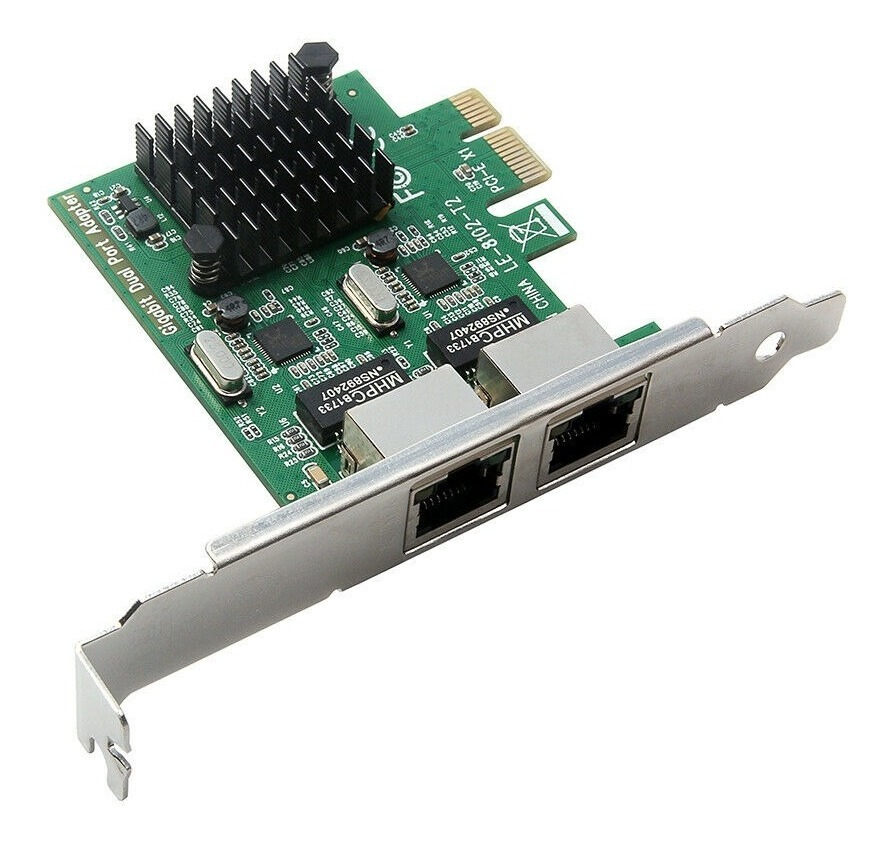
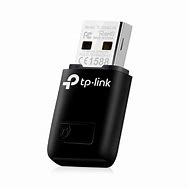
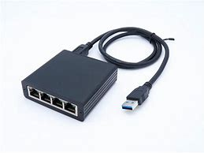
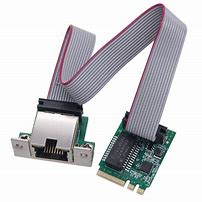

# TarjetaDeRed

## INICIO

Las tarjetas de red, son las encargadas de proporcionarnos conectividad a la red. Gracias a ella podemos navegar por la red, comunicarnos con dispositivos externos e incluso nos permite establecer una comunicación a tiempo real gracias al protocolo TCP/IP.

Todas las tarjetas de red se forman por una **MAC**, que define su identidad.

### Características principales

#### Tipos de conexión

##### Conexión LAN (Ethernet)
Las tarjetas de red Ethernet utilizan un conector **RJ45** para establecer una conexión cableada entre el dispositivo y la red. Este tipo de conexión tiene una ventaja importante en cuanto a **estabilidad y velocidad**, lo que se traduce en una mayor **confiabilidad** y menor latencia. Son especialmente útiles para actividades como el **gaming** o la **transmisión de grandes volúmenes de datos**.

##### Conexión WiFi (inalámbrica)
Las tarjetas Wi-Fi permiten conectarse a **redes inalámbricas** a través de un **router**, utilizando antenas externas o internas. Las velocidades de conexión pueden variar dependiendo del **estándar de Wi-Fi** soportado y la distancia al **router**, además de las **interferencias** que puedan existir en el entorno. Los estándares Wi-Fi más comunes son:

- **Wi-Fi 4**: Hasta **600 Mb/s**
- **Wi-Fi 5**: Hasta **3.5 Gb/s**
- **Wi-Fi 6**: Hasta **9.6 Gb/s**

Aunque las velocidades son más altas, la **latencia** (tiempo de respuesta) en las conexiones inalámbricas tiende a ser mayor que en las cableadas, lo que puede afectar el rendimiento en actividades de alta demanda.

#### Tipos de tarjetas de red

- **Las tarjetas PCI** que se conectan a una ranura **PCI** de la placa base. Fue un estándar muy común antes del **PCIe**. Ya están casi obsoletas. Llegan de entre **100 Mb/s y 1 Gb/s**.

- **Las tarjetas PCI EXPRESS** que son las que se conectan en las ranuras **PCI EXPRESS** de la placa base, son las más utilizadas a día de hoy para ordenadores de escritorio.

- **Los adaptadores por USB**, son las que se conectan a un puerto **USB** del dispositivo, son populares por su fácil uso e implementación. Su conexión depende del tipo de **USB** (3.0, 3.1...) que soporte. Populares para ordenadores portátiles que no tengan adaptador de red integrado.

 

- Y por último, **las tarjetas de red por M.2**, que son muy comunes en los **ordenadores portátiles**, ya que vienen integradas en su **placa base**.

#### Aspectos a tener en cuenta al comprar una tarjeta de red

En conclusión, lo más importante para una tarjeta de red es su **ancho de banda** (GHz), la **velocidad de transmisión** (Gb/s o Mb/s), el **estándar Wi-Fi** que soporte en caso de que sean tarjetas inalámbricas, y el tipo de **puerto** (Gigabit o Fast Ethernet), siendo más rápidos los **Gigabits** para las tarjetas cableadas. El tipo de conexión, que las más eficientes son las **PCI EXPRESS**, y por último, su **precio**, ya que tampoco hace falta invertir demasiado en este tipo de hardware.

